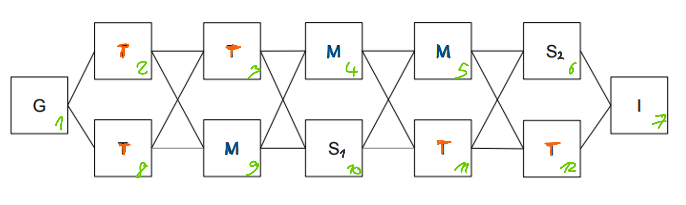

# PDDL modelling 

This project aims at modelling the domain and problem for a game using PDDL.

## The Domain - Real Player Game Scenario

 *Help the hero to get out of dungeon!*
 
 A hero woke up in a dungeon full of monsters and traps (perhaps the party last night went wrong...) and needs your help to get out.  Here are basic facts for the dungeon domain:
- The dungeon contains rooms that are **connected** by corridors (dungeon can thus be represented by undirected graph)
- each room can be **empty**, or can have a **monster** in it, or can have a **trap** in it, or can have a **sword** in it
- one of the empty rooms is the **goal**: it has an exit, so the hero can escape

The hero is lucky since she/he has full knowledge about the dungeon. But not that lucky – just after the hero leaves each room s/he visits, the room is **destroyed** and cannot be visited again.

The hero can perform the following actions – but only if s/he is alive!
- The hero can **move** to an adjacent room (connected by a corridor) that has not been destroyed (i.e., the hero has not already visited the room)
- **Pickup** the sword if present in the room the hero is currently in and the hero is empty handed
- **Destroy** the sword that the hero currently holds. However, this can have unpleasant effects if done in a room with a trap or a monster: it triggers the trap or invites the monster to eat the hero.
- **Disarm a trap** – if there is a trap in the room the hero is in and the hero is empty-handed (does not hold a sword), then the hero can disarm it

However, there are some (dangerous) constraints the hero has to consider:
- If the hero enters a room with a monster in it, s/he has to carry a sword (so the monster is afraid of him/her), otherwise the monster kills him/her. Notice that the hero is pacifist, so s/he cannot kill the monster.
- If the hero destroys the sword in a room with a monster in it, the monster kills him/her as well.
- The only action the hero can safely perform in a room with a trap in it is the **disarm a trap** action. Any other action (even moving away) triggers the trap which kills the hero.

## Problem 1

The problems are specified such that cells stand for rooms and edges between them represent corridors. **I** is the hero's initial position, **G** is hero's desired goal position, **$S_i$** indicates a sword, **M** is a monster, and **T** stands for trap. Good luck!

## Problem 2

## Problem 3

***Note: domain.pddl defines the domain with facts and actions. The problem.pddl files define each problem in detail with the initial and goal states.***

## How to run the files ? 

Simply download and drop the files in this [PDDL Editor](http://editor.planning.domains/). 

### Acknowledgements

This problem was originally proposed at _The Fifth International Competition on Knowledge Engineering for Planning and Scheduling_ [ICKEPS 2016](https://ickeps2016.wordpress.com/scenarios/). Author: [Lukas Chrpa](http://ktiml.mff.cuni.cz/~chrpa/), Charles University in Prague. 
